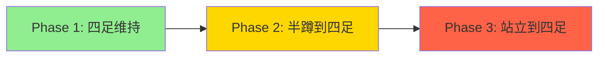

# V5 方案：逆向训练（Reverse Curriculum）

## 问题回顾

经过4轮奖励函数迭代，纯靠奖励塑形（reward shaping）无法解决"站立→四足"这个复杂多阶段任务：

| 版本 | 策略行为 | 根因 |
|------|---------|------|
| v1 | 后仰摔倒 | gravity方向符号错误 |
| v2 | 完全扑倒 h=0.055m | forward_lean(tanh) 扑倒拿满分 |
| v3 | 头顶地支撑 | forward_lean(钟形) 头顶地维持目标角度 |
| v4 | 直接向前摔倒 | 移除方向引导后无过渡信号 |

**根本原因：** 站立→四足是一个需要精确协调的多阶段动作序列（下蹲→前倾→手臂前伸→手着地→重心前移→四点支撑），RL策略从零开始探索几乎不可能偶然发现这个序列。

## V5 方案：逆向课程学习

### 核心思路

**不要从站立开始训练，而是从目标姿态（四足支撑）开始训练。**

分三个阶段：

### Phase 1：四足姿态维持（最简单）

**目标：** 机器人从四足姿态开始，学会维持四足支撑不倒。

**初始状态：**
- 质心高度：0.19m（四足目标高度）
- 躯干前倾约25度
- 髋关节弯曲约90度
- 肩关节前伸
- 四肢末端接触地面

**奖励函数（极简版）：**
1. `reach_target_height` (w=+1.0) — 维持0.19m高度
2. `quadruped_stance` (w=+2.0) — 四肢接地承重
3. `trunk_contact_pen` (w=-2.0) — 躯干不触地
4. `orientation_prone` (w=-0.3) — 维持目标姿态
5. `base_stability` (w=-0.1) — 稳定性
6. `alive_bonus` (w=+0.5) — 活着就有奖励（增大，鼓励存活）

**关键修改：**
- 初始状态设为四足姿态（需要计算关节角度）
- 移除所有"过渡引导"奖励（forward_lean, anti_backward_fall, hand_forward_reach）
- 增大 alive_bonus 鼓励存活
- 不需要 height_floor（初始就在目标高度）

### Phase 2：半蹲到四足（中等难度）

**目标：** 从半蹲姿态过渡到四足支撑。

**初始状态随机化：**
- 质心高度：0.19m ~ 0.25m（随机）
- 躯干角度：0° ~ 25°（随机）
- 关节角度在四足姿态附近随机扰动

**新增奖励：**
- `hand_forward_reach` (w=+0.3) — 引导手臂前伸

### Phase 3：站立到四足（最终目标）

**目标：** 从完全站立过渡到四足支撑。

**初始状态：**
- 标准站立姿态（当前配置）

**使用 Phase 1+2 训练好的策略作为初始化。**

## 实施计划

### Step 1：计算四足姿态的关节角度

V3 机器人关节结构（26 DOF）：

**躯干：**
- Waist: 腰部旋转（绕Z轴），limits [-0.52, 0.52]
- Waist_2: 腰部俯仰，limits [-3.14, 3.14]

**右臂（6 DOF）：**
- RSDp: 右肩pitch，limits [-0.75, 1.57]
- RSDy: 右肩yaw
- RSDr: 右肩roll
- RARMp: 右肘pitch
- RARMAP: 右前臂pitch
- RARMAy: 右手腕yaw

**左臂（6 DOF）：**
- LSDp ~ LARMAy（对称）

**右腿（6 DOF）：**
- RHIPp: 右髋pitch
- RHIPy: 右髋yaw
- RHIPr: 右髋roll
- RKNEEP: 右膝pitch
- RANKLEp: 右踝pitch
- RANKLEy: 右踝yaw

**左腿（6 DOF）：**
- LHIPp ~ LANKLEy（对称）

**四足姿态关节角度估算：**
- Waist: 0（不旋转）
- Waist_2: ~0.4 rad（前倾约25°）
- 肩关节: 前伸（RSDp/LSDp ≈ 1.0 rad）
- 肘关节: 伸直（RARMp/LARMp ≈ 0）
- 髋关节: 弯曲（RHIPp/LHIPp ≈ -1.2 rad）
- 膝关节: 弯曲（RKNEEP/LKNEEp ≈ 1.5 rad）
- 踝关节: 调整使脚底平放

> **注意：** 这些角度需要通过仿真验证和调整。建议先写一个脚本在 Isaac Sim 中手动设置关节角度，观察姿态是否正确。

### Step 2：修改环境配置

在 `prone_env_cfg.py` 中：

1. 修改 `V3StandToProneSceneCfg.robot.init_state`：
   - `pos`: (0.0, 0.0, 0.19) — 四足高度
   - `rot`: 前倾25°的四元数
   - `joint_pos`: 四足姿态的关节角度字典

2. 简化奖励配置（Phase 1 版本）

3. 增大 `alive_bonus` 权重

### Step 3：验证四足姿态

写一个调试脚本，在 Isaac Sim 中加载机器人并设置四足关节角度，验证：
- 机器人是否稳定站在四足姿态
- 质心高度是否约0.19m
- 四肢是否接触地面
- 躯干是否悬空

### Step 4：训练 Phase 1

使用简化的奖励函数训练，目标是机器人能稳定维持四足姿态。

### Step 5：逐步扩展到 Phase 2 和 Phase 3

使用 Isaac Lab 的 CurriculumManager 逐步增加初始状态的随机化范围。

## 为什么这个方案能成功

1. **Phase 1 极其简单** — 机器人已经在目标姿态，只需要学会"不倒"
2. **奖励信号密集** — 初始状态就能拿到高奖励，策略有明确的梯度方向
3. **逐步增加难度** — 每个阶段都建立在上一阶段的基础上
4. **避免了所有之前的捷径** — 不需要方向引导奖励，因为初始状态就是目标状态
